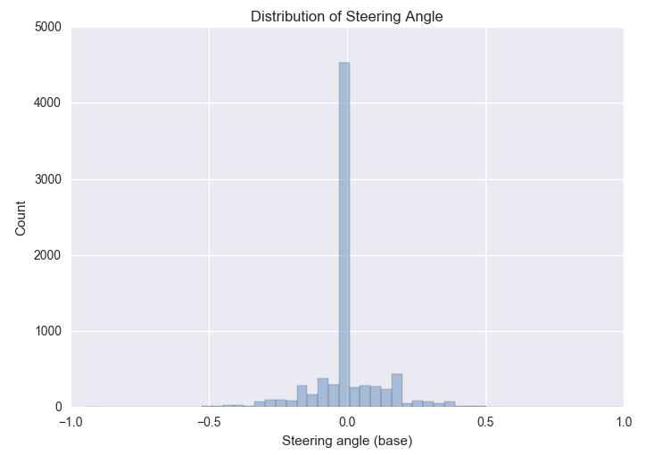
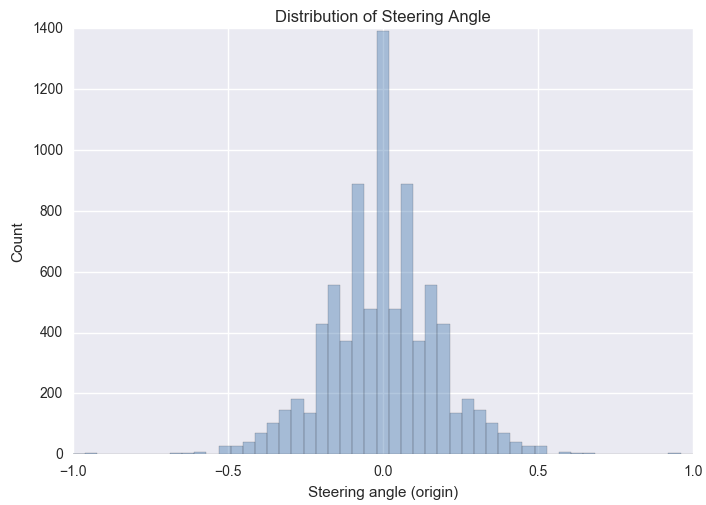
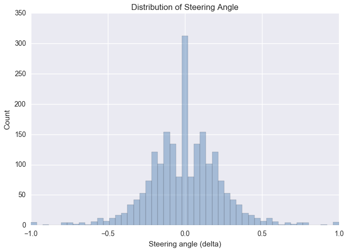
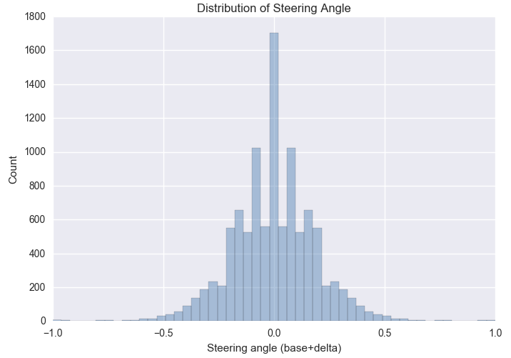

# Behavioral Cloning

In this project I developed a deep learning model for a self driving car in a simulator. The [report](writeup_report.md) shows a detailed explanation of my approach.

## First Attempt
For my first attempt I just used the provided data of udacity and build a simple neural network. After my first training I immediately started the autonomous mode of the simulator. I took this approach to get a feeling about the data and to found out where the difficulties of the challenge are nested. My first model tend to overfit and only predicte one category of steering angle. So I started to analyse the data and found out that there are too much zero values of the steering angle. 

Before starting with the next training of my model I decided to use a smaller amout of the zero steering angles. If you are interested of the code, you can take a quick look at [preprocess.py](preprocess.py) (save_file method line 42). The trained model did not tend to overfit.

Also I started the flip the images and negate the steering angle to generate more data and get an equal distribution of the steering angles. (line 38 in [preprocess.py](preprocess.py))

After the next training the model predicted this:

So I decided to record some data at the points where the trained model failed. Also I decides to keep a margin of zero values.

## Final Solution

The data which I used for my final model is distributed as in the following analysis. I could reduce the zero steering angles a little bit more. However, the model is doing a good job and it is working for the first track.

The final model:

