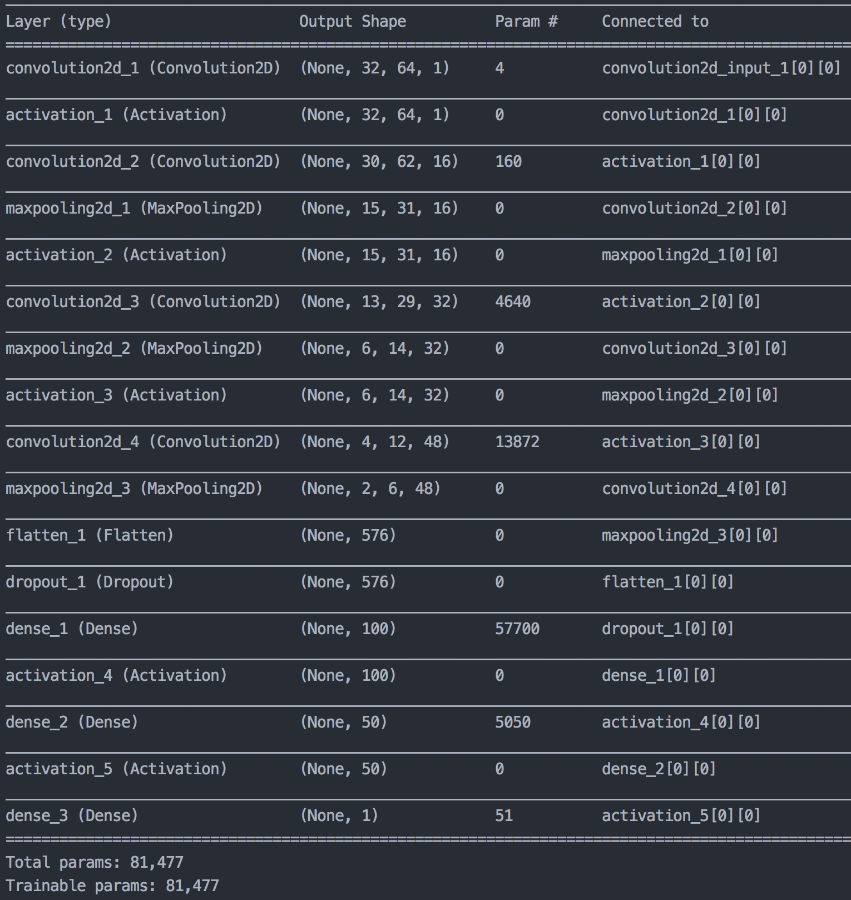

#**Behavioral Cloning**

**Behavioral Cloning Project**

The goals / steps of this project are the following:
* Use the simulator to collect data of good driving behavior
* Build, a convolution neural network in Keras that predicts steering angles from images
* Train and validate the model with a training and validation set
* Test that the model successfully drives around track one without leaving the road
* Summarize the results with a written report


[//]: # (Image References)

[image1]: ./report/placeholder.png "Model Visualization"
[image2]: ./examples/placeholder.png "Grayscaling"
[image3]: ./examples/placeholder_small.png "Recovery Image"
[image4]: ./examples/placeholder_small.png "Recovery Image"
[image5]: ./examples/placeholder_small.png "Recovery Image"
[image6]: ./examples/placeholder_small.png "Normal Image"
[image7]: ./examples/placeholder_small.png "Flipped Image"

---
###Files

####1. Submission includes all required files and can be used to run the simulator in autonomous mode. The data is currently *not* included into this repository.

My project includes the following files:
* preparation.py this script was created for an easier data wrangling
* preprocess.py contains the data pipeline as well as the preparation of the test dataset
* model.py containing the script to create and train the model
* drive.py for driving the car in autonomous mode
* model.h5 containing a trained convolution neural network
* writeup_report.md summarizing the results

####2. Submssion includes functional code
Using the Udacity provided simulator and my drive.py file, the car can be driven autonomously around the track by executing
```sh
python drive.py model.json
```

####3. Submssion code is usable and readable

The model.py file contains the code for training and saving the convolution neural network. The file shows the pipeline I used for training and validating the model, and it contains comments to explain how the code works.

###Model Architecture and Training Strategy

####1. An appropriate model architecture has been employed

The model consists of four convolutional and four fully connected layers. I used [RELU](https://en.wikipedia.org/wiki/Rectifier_(neural_networks)) layers to introduce nonlinearity.

The first layer is some kind of normalization layer. The input shape is 32, 64, 3 and the output is same size except that the colour channel (3) is reduced to one dimension.

The three following convolutional layers have a kernel size of 3x3 pixels. The number of the filters is 16, 32 and 48.
The convolutional layer are using max pooling for dimensionality reduction. The size of the pool is 2x2 pixels.

The following layers are fully connected layers which reduce the number of neurons from 576, 100, 50 to finally 1 neuron (output).

####2. Attempts to reduce overfitting in the model

The model contains dropout layers in order to reduce overfitting (model.py line 48).

The model was trained on different data sets to ensure that the model was not overfitting. The model was tested by running it through the simulator and ensuring that the vehicle could stay on the track.

####3. Model parameter tuning

The model used an adam optimizer, so the learning rate was not tuned manually (model.py line 59).

####4. Appropriate training data

Training data was chosen to keep the vehicle driving on the road. I used a combination of center lane driving as well as recovering strategies to prevent the car from leaving the streets.

For details about how I created the training data, see the next section.

###Model Architecture and Training Strategy

####1. Solution Design Approach

The overall strategy for deriving a model architecture was to build a similar model architecture like in the paper [End to End Learning for Self-Driving Cars](http://images.nvidia.com/content/tegra/automotive/images/2016/solutions/pdf/end-to-end-dl-using-px.pdf)
This involved the mixture between convolution neural networks and fully connected layers.

I implemented different architectures and the code in model.py contains my final solution.

In order to gauge how well the model was working, I split my image and steering angle data into a training set. I found that my first model had a low mean squared error on the training set but a high mean squared error on the validation set. This implied that the model was overfitting.

To combat the overfitting, I modified the model with dropout layer. Also I tried different data batches. Since the first track contains a lot of straight lines, my initial dataset contained a lot of zeros steering angles. That has the consequence of predicting zero every time.
To combat this kind of overfitting I decided to select the better distribution of the data contain more not zero steering angles. The selected dataset contained ~10% with a steering angle of zero.

The final step was to run the simulator to see how well the car was driving around track one. There were a few spots where the vehicle fell off the track. In some cases I decided to re-record the data and add some new data points. I did not include the zero steering angle data.

At the end of the process, the vehicle is able to drive autonomously around the track without leaving the road. The vehicle will not leave the road of track 1. However, I observed that the model drives more on the left side than on the right side. This behaviour is explained by only using a low data volume.

####2. Final Model Architecture

The model consists of four convolutional and four fully connected layers. I used [RELU](https://en.wikipedia.org/wiki/Rectifier_(neural_networks)) layers to introduce nonlinearity.

The first layer is some kind of normalization layer. The input shape is 32, 64, 3 and the output is same size except that the colour channel (3) is reduced to one dimension.

The three following convolutional layers have a kernel size of 3x3 pixels. The number of the filters is 16, 32 and 48.
The convolutional layer are using max pooling for dimensionality reduction. The size of the pool is 2x2 pixels.

The following layers are fully connected layers which reduce the number of neurons from 576, 100, 50 to finally 1 neuron (output).

Here is an overview of the architecture.



####3. Creation of the Training Set & Training Process

Before I generated new training data, I threw the provided data of udacity into a neural network and observed the places where the model fails.
To improve the driving behavior, I recorded the failing places and retrained the model.

I finally randomly shuffled the data set and in the beginning I used a validation set of data until I found a fitting deep learning architecture. (Note: I am not using a validation set anymore)

I iterated through this process until the model was successfully passing a round.